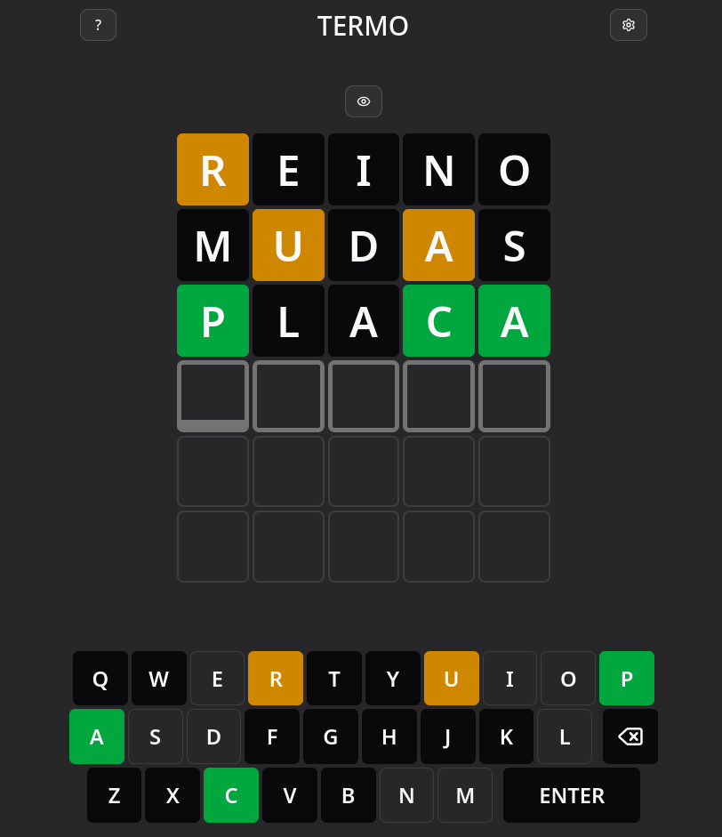
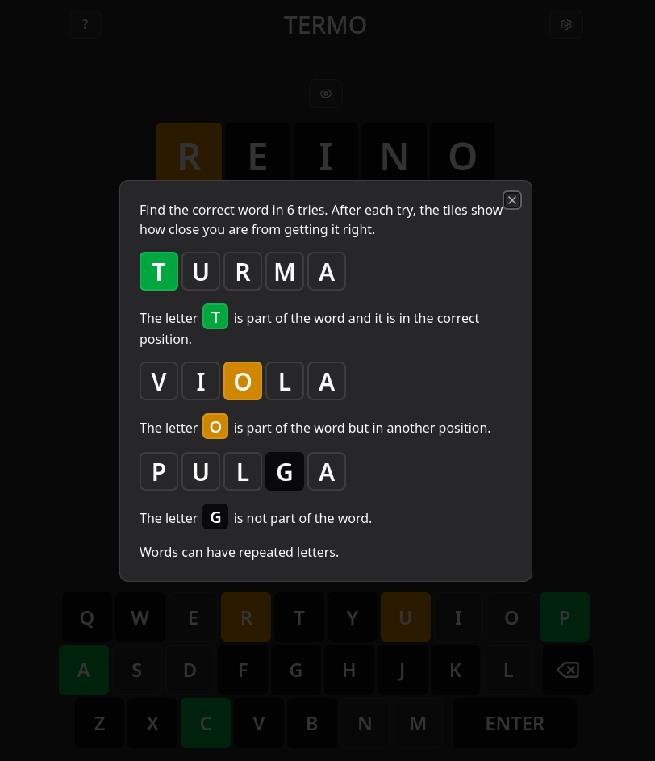

# Termo
Termo is a Brazilian Portuguese version of [Wordle](https://www.nytimes.com/games/wordle/index.html), inspired by the game with the same name: [Termo](https://term.ooo/).

## Screenshots

<p align="center">
    
    
</p>

## Requirements
- Docker
- Docker Compose

## Installation
Termo is meant to be self-hosted. To install it, run the following command in the project's root directory:

```
docker compose up -d
```

After that, the app will be ready in http://localhost:8080. You can change the port in the **docker-compose.yml** file.

## Development
Navigate to the `termo-api` folder and run the .NET backend with `dotnet run`. By default, it's going to run at http://localhost:5274. This is the URL the Vue.js frontend expects. If you change that, you'll also need to change proxy settings in [vite.config.ts](./termo-ui/vite.config.ts).

As for the frontend, navigate to the `termo-ui` folder and run `bun dev`. Now, you can access the app at http://localhost:5173.

## Todo
- [ ] Show a dialog when a game is won or lost.
- [ ] Multiple boards/games at once, like the original [Termo](https://term.ooo/).
- [ ] Multi-language support for words and interface language: Portuguese and English.
